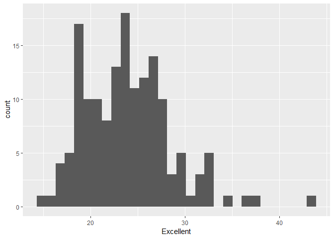
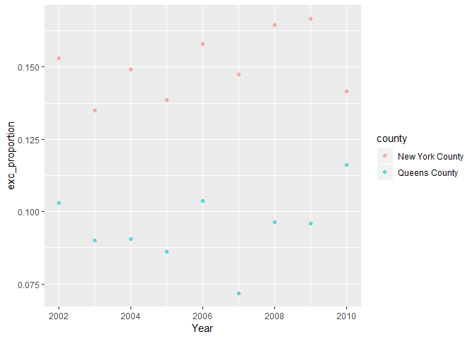

p8105\_hw2\_ph2538
================
Pei Yang Hsieh
2018-09-28

``` r
library(tidyverse)
```

    ## -- Attaching packages --------------------------------------------------------------------- tidyverse 1.2.1 --

    ## v ggplot2 3.0.0     v purrr   0.2.5
    ## v tibble  1.4.2     v dplyr   0.7.6
    ## v tidyr   0.8.1     v stringr 1.3.1
    ## v readr   1.1.1     v forcats 0.3.0

    ## -- Conflicts ------------------------------------------------------------------------ tidyverse_conflicts() --
    ## x dplyr::filter() masks stats::filter()
    ## x dplyr::lag()    masks stats::lag()

``` r
library(ggplot2)
library(readxl)
library(devtools)
```

The purpose of this file is to complete homework
2.

## Problem 1

### Loading and Cleaning Data

``` r
#Load and clean data: retain line, station, name, station latitude/longitude, routes served, entry, vending, entrance type, and ADA compliance
#Convert entry variable from character (YES vs NO) to logical variable

NYC_transit_data = read_csv(file = "./data/NYC_Transit_Subway_Entrance_And_Exit_Data.csv") %>%
  janitor::clean_names() %>%
  select(line, station_name, station_latitude, station_longitude, starts_with("route"), entry, vending, entrance_type, ada) %>%
  mutate(entry = recode(entry, 'YES' = "TRUE", 'NO' = "FALSE"))
```

    ## Parsed with column specification:
    ## cols(
    ##   .default = col_character(),
    ##   `Station Latitude` = col_double(),
    ##   `Station Longitude` = col_double(),
    ##   Route8 = col_integer(),
    ##   Route9 = col_integer(),
    ##   Route10 = col_integer(),
    ##   Route11 = col_integer(),
    ##   ADA = col_logical(),
    ##   `Free Crossover` = col_logical(),
    ##   `Entrance Latitude` = col_double(),
    ##   `Entrance Longitude` = col_double()
    ## )

    ## See spec(...) for full column specifications.

Write a short paragraph about this dataset - explain briefly what
variables the dataset contains, describe your data cleaning steps so
far, and give the dimension (rows x columns) of the resulting dataset.
Are these data tidy?

This dataset includes variables on line, station name, station latitude
and longitude, routes, entry, vending, entrance type, and ADA
compliance. My data cleaning steps have included loading the data and
cleaning the variable names, so they are all in snake case. Next, I
selected only the variables that I needed, discarding the rest. Lastly,
I converted the entry variable from a character to a logical variable.

The dimensions of the resulting dataset are 1868, 19

These data are not tidy because the the routes are spread across
multiple columns, with many missing values.

### Answer the following questions

-----

  - How many distinct stations are there? Note that stations are
    identified both by name and by line (e.g. 125th St A/B/C/D; 125st 1;
    125st 4/5)

  - How many stations are ADA compliant?

  - What proportion of station entrances / exits without vending allow
    entrance?

<!-- end list -->

``` r
#distinct removes duplicated rows based on line and station name
count(distinct(NYC_transit_data, line, station_name))
```

    ## # A tibble: 1 x 1
    ##       n
    ##   <int>
    ## 1   465

``` r
#There are 465 distinct stations.

#count how many distinct stations are ADA compliant
NYC_transit_data %>%
  filter(ada == "TRUE") %>%
  count(station_name, line, ada) %>%
  summarise(n = n())
```

    ## # A tibble: 1 x 1
    ##       n
    ##   <int>
    ## 1    84

``` r
#82 distinct stations are ADA compliant

#proportion of station entrance/exit without vending allow entrance
NYC_vending = filter(NYC_transit_data, vending == "NO")
mean(NYC_vending$entry == TRUE)
```

    ## [1] 0.3770492

``` r
#Proportion is 0.377
```

### Reformat data

Reformat data so that route number and route name are distinct
variables. How many distinct stations serve the A train? Of the stations
that serve the A train, how many are ADA compliant?

``` r
#For all routes, separate route number and name into distinct variables
reform_NYC_transit = gather(NYC_transit_data, key = route_number, value = route_name, route1:route11)

#How many distinct stations serve the A train?
filter_NYC_transit_A = filter(reform_NYC_transit, route_name == 'A')
count(distinct(filter_NYC_transit_A, line, station_name))
```

    ## # A tibble: 1 x 1
    ##       n
    ##   <int>
    ## 1    60

``` r
#60 

#of stations that serve A train, how many are ADA compliant?
filter_NYC_transit_A %>%
  filter(ada == "TRUE") %>%
  count(station_name, line, ada) %>%
  summarise(n = n())
```

    ## # A tibble: 1 x 1
    ##       n
    ##   <int>
    ## 1    17

``` r
#Out of distinct stations that serve A train, 17 are ADA compliant
```

## Problem 2

``` r
#specify the sheet in the Excel file and to omit columns containing notes (using the range argument and cell_cols() function)
#omit rows that do not include dumpster-specific data
#rounds the number of sports balls to the nearest integer and converts the result to an integer variable (using as.integer)
trash_wheel_data = read_excel("./data/HealthyHarborWaterWheelTotals2017-9-26.xlsx", sheet = "Mr. Trash Wheel", range = cell_cols(1:14)) %>%
  janitor::clean_names() %>%
  filter(!is.na(dumpster)) %>%
  mutate(sports_balls = as.integer(sports_balls))

head(trash_wheel_data)
```

    ## # A tibble: 6 x 14
    ##   dumpster month  year date                weight_tons volume_cubic_ya~
    ##      <dbl> <chr> <dbl> <dttm>                    <dbl>            <dbl>
    ## 1        1 May    2014 2014-05-16 00:00:00        4.31               18
    ## 2        2 May    2014 2014-05-16 00:00:00        2.74               13
    ## 3        3 May    2014 2014-05-16 00:00:00        3.45               15
    ## 4        4 May    2014 2014-05-17 00:00:00        3.1                15
    ## 5        5 May    2014 2014-05-17 00:00:00        4.06               18
    ## 6        6 May    2014 2014-05-20 00:00:00        2.71               13
    ## # ... with 8 more variables: plastic_bottles <dbl>, polystyrene <dbl>,
    ## #   cigarette_butts <dbl>, glass_bottles <dbl>, grocery_bags <dbl>,
    ## #   chip_bags <dbl>, sports_balls <int>, homes_powered <dbl>

``` r
dim(trash_wheel_data)
```

    ## [1] 216  14

``` r
#Read and clean precipitation data for 2016 and 2017. For each, omit rows without precipitation data and add a variable year. Next, combine datasets and convert month to a character variable (the variable month.name is built into R and should be useful).
```

## Problem 3

``` r
#devtools::install_github("p8105/p8105.datasets")
library(p8105.datasets)

data(brfss_smart2010)

brfss_smart2010
```

    ## # A tibble: 134,203 x 23
    ##     Year Locationabbr Locationdesc Class Topic Question Response
    ##    <int> <chr>        <chr>        <chr> <chr> <chr>    <chr>   
    ##  1  2010 AL           AL - Jeffer~ Heal~ Over~ How is ~ Excelle~
    ##  2  2010 AL           AL - Jeffer~ Heal~ Over~ How is ~ Very go~
    ##  3  2010 AL           AL - Jeffer~ Heal~ Over~ How is ~ Good    
    ##  4  2010 AL           AL - Jeffer~ Heal~ Over~ How is ~ Fair    
    ##  5  2010 AL           AL - Jeffer~ Heal~ Over~ How is ~ Poor    
    ##  6  2010 AL           AL - Jeffer~ Heal~ Fair~ Health ~ Good or~
    ##  7  2010 AL           AL - Jeffer~ Heal~ Fair~ Health ~ Fair or~
    ##  8  2010 AL           AL - Jeffer~ Heal~ Heal~ Do you ~ Yes     
    ##  9  2010 AL           AL - Jeffer~ Heal~ Heal~ Do you ~ No      
    ## 10  2010 AL           AL - Jeffer~ Heal~ Unde~ Adults ~ Yes     
    ## # ... with 134,193 more rows, and 16 more variables: Sample_Size <int>,
    ## #   Data_value <dbl>, Confidence_limit_Low <dbl>,
    ## #   Confidence_limit_High <dbl>, Display_order <int>,
    ## #   Data_value_unit <chr>, Data_value_type <chr>,
    ## #   Data_Value_Footnote_Symbol <chr>, Data_Value_Footnote <chr>,
    ## #   DataSource <chr>, ClassId <chr>, TopicId <chr>, LocationID <chr>,
    ## #   QuestionID <chr>, RESPID <chr>, GeoLocation <chr>

``` r
janitor::clean_names(brfss_smart2010)
```

    ## # A tibble: 134,203 x 23
    ##     year locationabbr locationdesc class topic question response
    ##    <int> <chr>        <chr>        <chr> <chr> <chr>    <chr>   
    ##  1  2010 AL           AL - Jeffer~ Heal~ Over~ How is ~ Excelle~
    ##  2  2010 AL           AL - Jeffer~ Heal~ Over~ How is ~ Very go~
    ##  3  2010 AL           AL - Jeffer~ Heal~ Over~ How is ~ Good    
    ##  4  2010 AL           AL - Jeffer~ Heal~ Over~ How is ~ Fair    
    ##  5  2010 AL           AL - Jeffer~ Heal~ Over~ How is ~ Poor    
    ##  6  2010 AL           AL - Jeffer~ Heal~ Fair~ Health ~ Good or~
    ##  7  2010 AL           AL - Jeffer~ Heal~ Fair~ Health ~ Fair or~
    ##  8  2010 AL           AL - Jeffer~ Heal~ Heal~ Do you ~ Yes     
    ##  9  2010 AL           AL - Jeffer~ Heal~ Heal~ Do you ~ No      
    ## 10  2010 AL           AL - Jeffer~ Heal~ Unde~ Adults ~ Yes     
    ## # ... with 134,193 more rows, and 16 more variables: sample_size <int>,
    ## #   data_value <dbl>, confidence_limit_low <dbl>,
    ## #   confidence_limit_high <dbl>, display_order <int>,
    ## #   data_value_unit <chr>, data_value_type <chr>,
    ## #   data_value_footnote_symbol <chr>, data_value_footnote <chr>,
    ## #   data_source <chr>, class_id <chr>, topic_id <chr>, location_id <chr>,
    ## #   question_id <chr>, respid <chr>, geo_location <chr>

``` r
#focus on the “Overall Health” topic
#exclude variables for class, topic, question, sample size, and everything from lower confidence limit to GeoLocation
#structure data so that responses (excellent to poor) are variables taking the value of Data_value

clean_brfss = filter(brfss_smart2010, Topic == "Overall Health") %>%
  select(Year, Locationabbr, Locationdesc, Response, Data_value) %>%
  spread(key = Response, value = Data_value) %>%
  separate(Locationdesc, into = c("state", "county"), sep = " - ") %>%
  select(-Locationabbr)


#select(brfss_smart2010, -Class, -Topic, -Question, -Sample_Size, -Confidence_limit_Low:GeoLocation)

#create a new variable showing the proportion of responses that were “Excellent” or “Very Good”
clean_brfss$exc_vgood_proportion = (
  clean_brfss$Excellent + clean_brfss$'Very good') / 
  sum(clean_brfss$Excellent:clean_brfss$'Very good')
```

    ## Warning in clean_brfss$Excellent:clean_brfss$"Very good": numerical
    ## expression has 2125 elements: only the first used
    
    ## Warning in clean_brfss$Excellent:clean_brfss$"Very good": numerical
    ## expression has 2125 elements: only the first used

``` r
#How many unique locations are included in the dataset? Is every state represented? What state is observed the most?

length(unique(clean_brfss$county))
```

    ## [1] 351

``` r
#351 counties

length(unique(clean_brfss$state))
```

    ## [1] 51

``` r
# Yes, every state is represented. There are 51 unique states because it includes Washington DC.

table(clean_brfss$state)
```

    ## 
    ##  AK  AL  AR  AZ  CA  CO  CT  DC  DE  FL  GA  HI  IA  ID  IL  IN  KS  KY 
    ##  11  18  21  32  52  59  47   9  27 122  27  31  14  32  25  21  38   9 
    ##  LA  MA  MD  ME  MI  MN  MO  MS  MT  NC  ND  NE  NH  NJ  NM  NV  NY  OH 
    ##  45  79  90  31  34  33  25  23  18 115  18  53  48 146  43  18  65  59 
    ##  OK  OR  PA  RI  SC  SD  TN  TX  UT  VA  VT  WA  WI  WV  WY 
    ##  40  33  59  38  63  18  26  71  50   4  48  97   9   9  22

``` r
# The results show that New Jersey is observed the most with 146 observations.

#In 2002, what is the median of the “Excellent” response value?
brfss_2002 = filter(clean_brfss, Year == '2002')
median(brfss_2002$Excellent, na.rm = TRUE)
```

    ## [1] 23.6

``` r
#The median values is 23.6

#Make a histogram of “Excellent” response values in the year 2002.
ggplot(brfss_2002, aes(x = Excellent)) + geom_histogram()
```

    ## `stat_bin()` using `bins = 30`. Pick better value with `binwidth`.

    ## Warning: Removed 2 rows containing non-finite values (stat_bin).

<!-- -->

``` r
#Make a scatterplot showing the proportion of “Excellent” response values in New York County and Queens County (both in NY State) in each year from 2002 to 2010.

clean_brfss$exc_proportion = (
  clean_brfss$Excellent) /
  sum(clean_brfss$Excellent:clean_brfss$'Very good')
```

    ## Warning in clean_brfss$Excellent:clean_brfss$"Very good": numerical
    ## expression has 2125 elements: only the first used
    
    ## Warning in clean_brfss$Excellent:clean_brfss$"Very good": numerical
    ## expression has 2125 elements: only the first used

``` r
brfss_NYC_Queens = filter(clean_brfss, county == "New York County" | county == "Queens County")

ggplot(brfss_NYC_Queens, aes(x = Year, y = exc_proportion)) + geom_point(aes(color = county), alpha = .5)
```

<!-- -->
