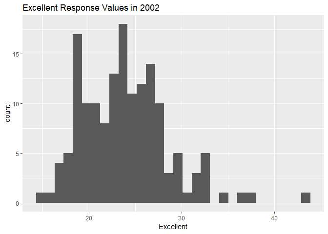
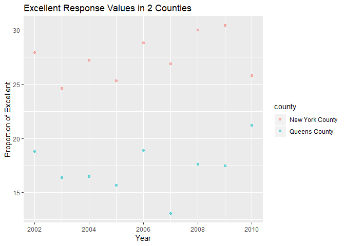

p8105\_hw2\_ph2538
================
Pei Yang Hsieh
2018-10-5

The purpose of this file is to complete homework
2.

## Problem 1

### Loading and cleaning transit data

``` r
#Load and clean data: retain line, station, name, station latitude/longitude, routes served, entry, vending, entrance type, and ADA compliance
#Convert entry variable from character (YES vs NO) to logical variable

NYC_transit_data = read_csv(file = "./data/NYC_Transit_Subway_Entrance_And_Exit_Data.csv") %>%
  janitor::clean_names() %>%
  select(line, station_name, station_latitude, station_longitude, starts_with("route"), entry, vending, entrance_type, ada) %>%
  mutate(entry = recode(entry, 'YES' = "TRUE", 'NO' = "FALSE"))
```

    ## Parsed with column specification:
    ## cols(
    ##   .default = col_character(),
    ##   `Station Latitude` = col_double(),
    ##   `Station Longitude` = col_double(),
    ##   Route8 = col_integer(),
    ##   Route9 = col_integer(),
    ##   Route10 = col_integer(),
    ##   Route11 = col_integer(),
    ##   ADA = col_logical(),
    ##   `Free Crossover` = col_logical(),
    ##   `Entrance Latitude` = col_double(),
    ##   `Entrance Longitude` = col_double()
    ## )

    ## See spec(...) for full column specifications.

This dataset includes variables on line, station name, station latitude
and longitude, routes, entry, vending, entrance type, and ADA
compliance. My data cleaning steps have included loading the data and
cleaning the variable names using janitor::clean\_names(), so all
variable names are in lower snake case. Next, I selected only the
variables that I needed, discarding the rest, using select command.
Lastly, I converted the entry variable from a character to a logical
variable using the mutate and recode commands.

The dimensions of the resulting dataset are 1868, 19

These data are not tidy because the the routes are spread across
multiple columns, with many missing
values.

### Questions 1-3 for Problem 1

|                                                                                                                                                  |
| ------------------------------------------------------------------------------------------------------------------------------------------------ |
| 1\. How many distinct stations are there? Note that stations are identified both by name and by line (e.g. 125th St A/B/C/D; 125st 1; 125st 4/5) |
| 2\. How many stations are ADA compliant?                                                                                                         |
| 3\. What proportion of station entrances / exits without vending allow entrance?                                                                 |

``` r
#distinct removes duplicated rows based on line and station name

count(distinct(NYC_transit_data, line, station_name))
```

    ## # A tibble: 1 x 1
    ##       n
    ##   <int>
    ## 1   465

1.  There are 465 distinct stations.

<!-- end list -->

``` r
#count how many distinct stations are ADA compliant

NYC_transit_data %>%
  filter(ada == "TRUE") %>%
  count(station_name, line, ada) %>%
  summarise(n = n())
```

    ## # A tibble: 1 x 1
    ##       n
    ##   <int>
    ## 1    84

2.  84 distinct stations are ADA compliant.

<!-- end list -->

``` r
#proportion of station entrance/exit without vending allow entrance

NYC_vending = filter(NYC_transit_data, vending == "NO")
mean(NYC_vending$entry == TRUE)
```

    ## [1] 0.3770492

3.  The proportion of station entrances / exits without vending allow
    entry is 0.377.

### Reformat transit data

Reformat data so that route number and route name are distinct
variables. How many distinct stations serve the A train? Of the stations
that serve the A train, how many are ADA compliant?

``` r
#For all routes, separate route number and name into distinct variables

reform_NYC_transit = gather(NYC_transit_data, key = route_number, value = route_name, route1:route11)
```

### Questions 4-5 for Problem 1

``` r
#How many distinct stations serve the A train?

filter_NYC_transit_A = filter(reform_NYC_transit, route_name == 'A')
count(distinct(filter_NYC_transit_A, line, station_name))
```

    ## # A tibble: 1 x 1
    ##       n
    ##   <int>
    ## 1    60

4.  60 distinct stations serve the A train.

<!-- end list -->

``` r
#of stations that serve A train, how many are ADA compliant?
filter_NYC_transit_A %>%
  filter(ada == "TRUE") %>%
  count(station_name, line, ada) %>%
  summarise(n = n())
```

    ## # A tibble: 1 x 1
    ##       n
    ##   <int>
    ## 1    17

5.  Out of distinct stations that serve A train, 17 are ADA
compliant.

## Problem 2

### Loading and cleaning trash wheel data

``` r
#specify the sheet in the Excel file and to omit columns containing notes (using the range argument and cell_cols() function)
#omit rows that do not include dumpster-specific data
#rounds the number of sports balls to the nearest integer and converts the result to an integer variable (using as.integer)
trash_wheel_data = read_excel("./data/HealthyHarborWaterWheelTotals2018-7-28.xlsx", sheet = "Mr. Trash Wheel", range = cell_cols(1:14)) %>%
  janitor::clean_names() %>%
  filter(!is.na(dumpster)) %>%
  mutate(sports_balls = as.integer(sports_balls))

head(trash_wheel_data)
```

    ## # A tibble: 6 x 14
    ##   dumpster month  year date                weight_tons volume_cubic_ya~
    ##      <dbl> <chr> <dbl> <dttm>                    <dbl>            <dbl>
    ## 1        1 May    2014 2014-05-16 00:00:00        4.31               18
    ## 2        2 May    2014 2014-05-16 00:00:00        2.74               13
    ## 3        3 May    2014 2014-05-16 00:00:00        3.45               15
    ## 4        4 May    2014 2014-05-17 00:00:00        3.1                15
    ## 5        5 May    2014 2014-05-17 00:00:00        4.06               18
    ## 6        6 May    2014 2014-05-20 00:00:00        2.71               13
    ## # ... with 8 more variables: plastic_bottles <dbl>, polystyrene <dbl>,
    ## #   cigarette_butts <dbl>, glass_bottles <dbl>, grocery_bags <dbl>,
    ## #   chip_bags <dbl>, sports_balls <int>, homes_powered <dbl>

``` r
dim(trash_wheel_data)
```

    ## [1] 285  14

### Loading, cleaning, combining precipitation data

``` r
#Read and clean precipitation data for 2016 and 2017. 
#For each, omit rows without precipitation data and add a variable year. 
#Next, combine datasets and convert month to a character variable (the variable month.name is built into R and should be useful).

Precipitation_2017 = read_excel("./data/HealthyHarborWaterWheelTotals2018-7-28.xlsx", sheet = "2017 Precipitation", skip = 1) %>%
  janitor::clean_names() %>%
  filter(total != 'NA') %>%
  filter(month != 'NA') %>%
  mutate(year = 2017)

Precipitation_2016 = read_excel("./data/HealthyHarborWaterWheelTotals2018-7-28.xlsx", sheet = "2016 Precipitation", skip = 1) %>%
  janitor::clean_names() %>%
  filter(total != 'NA') %>%
  filter(month != 'NA') %>%
  mutate(year = 2016)

#combine datasets
combine_prec = left_join(Precipitation_2016, Precipitation_2017, by = "month" )

#convert month to a character variable (the variable month.name is built into R and should be useful).
combine_prec$month = month.name

#rename variables for easier reference
combine_prec = rename(combine_prec, precip_2016 = total.x, year_2016 = year.x, precip_2017 = total.y, year_2017 = year.y)

combine_prec
```

    ## # A tibble: 12 x 5
    ##    month     precip_2016 year_2016 precip_2017 year_2017
    ##    <chr>           <dbl>     <dbl>       <dbl>     <dbl>
    ##  1 January          3.23      2016        2.34      2017
    ##  2 February         5.32      2016        1.46      2017
    ##  3 March            2.24      2016        3.57      2017
    ##  4 April            1.78      2016        3.99      2017
    ##  5 May              5.19      2016        5.64      2017
    ##  6 June             3.2       2016        1.4       2017
    ##  7 July             6.09      2016        7.09      2017
    ##  8 August           3.96      2016        4.44      2017
    ##  9 September        4.53      2016        1.95      2017
    ## 10 October          0.62      2016        0         2017
    ## 11 November         1.47      2016        0.11      2017
    ## 12 December         2.32      2016        0.94      2017

For trash wheel data, the dimension of the dataset (excluding NA) is
285, 14 which shows that there are 285 observations and 14 variables.
Key variables include dumpster number, date (including month and year),
weight (in tons), volume (in cubic yards), variables for different types
of trash, and number of homes powered. For example, the total weight
tons collected from 2014 to 2018 across all dumpsters is 934.94, total
number of plastic bottles collected is 5.611810^{5}, and total number of
homes powered is 1.195066710^{4}. The median number of sports balls in a
dumpster in 2016 is 26.

For precipitation data, the number of observations in 2016 was 12 and
the number of observations in 2017 was 12. This means that for both 2017
and 2016, there is precipitation data for all 12 months of the year, for
a total of 24 observations. The key variables are month and amount of
precipitation for both 2016 and 2017. The total precipitation in 2017 is
32.93.

## Problem 3

### Loading and cleaning brfss data

``` r
#devtools::install_github("p8105/p8105.datasets")
library(p8105.datasets)

data(brfss_smart2010)

brfss_smart2010
```

    ## # A tibble: 134,203 x 23
    ##     Year Locationabbr Locationdesc Class Topic Question Response
    ##    <int> <chr>        <chr>        <chr> <chr> <chr>    <chr>   
    ##  1  2010 AL           AL - Jeffer~ Heal~ Over~ How is ~ Excelle~
    ##  2  2010 AL           AL - Jeffer~ Heal~ Over~ How is ~ Very go~
    ##  3  2010 AL           AL - Jeffer~ Heal~ Over~ How is ~ Good    
    ##  4  2010 AL           AL - Jeffer~ Heal~ Over~ How is ~ Fair    
    ##  5  2010 AL           AL - Jeffer~ Heal~ Over~ How is ~ Poor    
    ##  6  2010 AL           AL - Jeffer~ Heal~ Fair~ Health ~ Good or~
    ##  7  2010 AL           AL - Jeffer~ Heal~ Fair~ Health ~ Fair or~
    ##  8  2010 AL           AL - Jeffer~ Heal~ Heal~ Do you ~ Yes     
    ##  9  2010 AL           AL - Jeffer~ Heal~ Heal~ Do you ~ No      
    ## 10  2010 AL           AL - Jeffer~ Heal~ Unde~ Adults ~ Yes     
    ## # ... with 134,193 more rows, and 16 more variables: Sample_Size <int>,
    ## #   Data_value <dbl>, Confidence_limit_Low <dbl>,
    ## #   Confidence_limit_High <dbl>, Display_order <int>,
    ## #   Data_value_unit <chr>, Data_value_type <chr>,
    ## #   Data_Value_Footnote_Symbol <chr>, Data_Value_Footnote <chr>,
    ## #   DataSource <chr>, ClassId <chr>, TopicId <chr>, LocationID <chr>,
    ## #   QuestionID <chr>, RESPID <chr>, GeoLocation <chr>

``` r
janitor::clean_names(brfss_smart2010)
```

    ## # A tibble: 134,203 x 23
    ##     year locationabbr locationdesc class topic question response
    ##    <int> <chr>        <chr>        <chr> <chr> <chr>    <chr>   
    ##  1  2010 AL           AL - Jeffer~ Heal~ Over~ How is ~ Excelle~
    ##  2  2010 AL           AL - Jeffer~ Heal~ Over~ How is ~ Very go~
    ##  3  2010 AL           AL - Jeffer~ Heal~ Over~ How is ~ Good    
    ##  4  2010 AL           AL - Jeffer~ Heal~ Over~ How is ~ Fair    
    ##  5  2010 AL           AL - Jeffer~ Heal~ Over~ How is ~ Poor    
    ##  6  2010 AL           AL - Jeffer~ Heal~ Fair~ Health ~ Good or~
    ##  7  2010 AL           AL - Jeffer~ Heal~ Fair~ Health ~ Fair or~
    ##  8  2010 AL           AL - Jeffer~ Heal~ Heal~ Do you ~ Yes     
    ##  9  2010 AL           AL - Jeffer~ Heal~ Heal~ Do you ~ No      
    ## 10  2010 AL           AL - Jeffer~ Heal~ Unde~ Adults ~ Yes     
    ## # ... with 134,193 more rows, and 16 more variables: sample_size <int>,
    ## #   data_value <dbl>, confidence_limit_low <dbl>,
    ## #   confidence_limit_high <dbl>, display_order <int>,
    ## #   data_value_unit <chr>, data_value_type <chr>,
    ## #   data_value_footnote_symbol <chr>, data_value_footnote <chr>,
    ## #   data_source <chr>, class_id <chr>, topic_id <chr>, location_id <chr>,
    ## #   question_id <chr>, respid <chr>, geo_location <chr>

``` r
#focus on the Overall Health topic
#exclude variables for class, topic, question, sample size, and everything from lower confidence limit to GeoLocation
#structure data so that responses (excellent to poor) are variables taking the value of Data_value

clean_brfss = filter(brfss_smart2010, Topic == "Overall Health") %>%
  select(Year, Locationabbr, Locationdesc, Response, Data_value) %>%
  spread(key = Response, value = Data_value) %>%
  separate(Locationdesc, into = c("state", "county"), sep = " - ") %>%
  select(-Locationabbr)

#create a new variable showing the proportion of responses that were Excellent or Very Good
clean_brfss$exc_vgood_proportion = (
  clean_brfss$Excellent + clean_brfss$'Very good') 
```

### Questions for Problem 3

|                                                                                                                                                                    |
| ------------------------------------------------------------------------------------------------------------------------------------------------------------------ |
| 1\. How many unique locations are included in the dataset? Is every state represented? What state is observed the most?                                            |
| 2\. In 2002, what is the median of the Excellent response value?                                                                                                   |
| 3\. Make a histogram of Excellent response values in the year 2002.                                                                                                |
| 4\. Make a scatterplot showing the proportion of Excellent response values in New York County and Queens County (both in NY State) in each year from 2002 to 2010. |

``` r
#How many unique locations are included in the dataset? Is every state represented? What state is observed the most?

count(distinct(clean_brfss, state, county))
```

    ## # A tibble: 1 x 1
    ##       n
    ##   <int>
    ## 1   404

``` r
length(unique(clean_brfss$state))
```

    ## [1] 51

``` r
sort(table(clean_brfss$state))
```

    ## 
    ##  VA  DC  KY  WI  WV  AK  IA  AL  MT  ND  NV  SD  AR  IN  WY  MS  IL  MO 
    ##   4   9   9   9   9  11  14  18  18  18  18  18  21  21  22  23  25  25 
    ##  TN  DE  GA  HI  ME  AZ  ID  MN  OR  MI  KS  RI  OK  NM  LA  CT  NH  VT 
    ##  26  27  27  31  31  32  32  33  33  34  38  38  40  43  45  47  48  48 
    ##  UT  CA  NE  CO  OH  PA  SC  NY  TX  MA  MD  WA  NC  FL  NJ 
    ##  50  52  53  59  59  59  63  65  71  79  90  97 115 122 146

1.  There are 404 unique locations.

Yes, every state is represented. There are 51 unique states because it
includes Washington DC.

The results show that New Jersey is observed the most with 146
observations.

``` r
#In 2002, what is the median of the Excellent response value?

brfss_2002 = filter(clean_brfss, Year == '2002')
median(brfss_2002$Excellent, na.rm = TRUE)
```

    ## [1] 23.6

2.  In 2002, the median of the “Excellent” response value is 23.6.

#### Question 3

``` r
#Make a histogram of Excellent response values in the year 2002.
ggplot(brfss_2002, aes(x = Excellent)) + geom_histogram() + labs(title = "Excellent Response Values in 2002")
```

    ## `stat_bin()` using `bins = 30`. Pick better value with `binwidth`.

    ## Warning: Removed 2 rows containing non-finite values (stat_bin).

<!-- -->

#### Question 4

``` r
#Make a scatterplot showing the proportion of Excellent response values in New York County and Queens County (both in NY State) in each year from 2002 to 2010.

brfss_NYC_Queens = filter(clean_brfss, county == "New York County" | county == "Queens County")

ggplot(brfss_NYC_Queens, aes(x = Year, y = Excellent)) + geom_point(aes(color = county), alpha = .5) + labs(title = "Excellent Response Values in 2 Counties", y ="Proportion of Excellent")
```

<!-- -->
